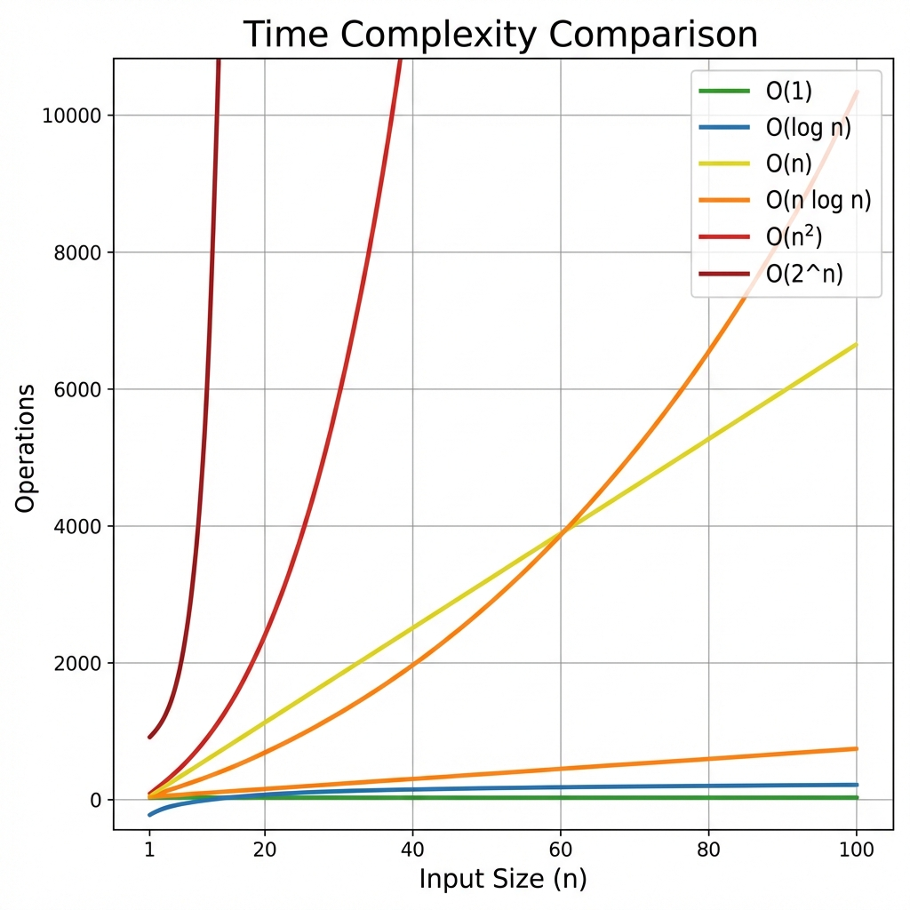

# 📊 Algorithm Complexity Guide

A comprehensive guide to understanding and analyzing time and space complexity of algorithms.

## 📖 Table of Contents
- [Big O Notation Basics](#big-o-notation-basics)
- [Common Time Complexities](#common-time-complexities)
- [Visual Complexity Comparison](#visual-complexity-comparison)
- [Algorithm Complexity Reference](#algorithm-complexity-reference)
- [Space Complexity](#space-complexity)
- [How to Analyze Complexity](#how-to-analyze-complexity)

---

## Big O Notation Basics

Big O notation describes the **upper bound** of algorithm performance as input size grows.

### Key Principles
1. **Drop constants**: O(2n) → O(n)
2. **Drop non-dominant terms**: O(n² + n) → O(n²)
3. **Different inputs use different variables**: O(a + b) not O(n)
4. **Focus on worst case** unless specified otherwise

---

## Common Time Complexities

From fastest to slowest:

| Complexity | Name | Example Operations | Growth Rate |
|------------|------|-------------------|-------------|
| **O(1)** | Constant | Array access, HashMap get/put | Best ⭐⭐⭐⭐⭐ |
| **O(log n)** | Logarithmic | Binary search, balanced BST ops | Excellent ⭐⭐⭐⭐ |
| **O(n)** | Linear | Array traversal, linear search | Good ⭐⭐⭐ |
| **O(n log n)** | Linearithmic | Merge sort, heap sort, quick sort (avg) | Acceptable ⭐⭐ |
| **O(n²)** | Quadratic | Nested loops, bubble sort | Poor ⚠️ |
| **O(n³)** | Cubic | Triple nested loops | Very Poor ❌ |
| **O(2^n)** | Exponential | Recursive fibonacci, subset generation | Terrible ❌❌ |
| **O(n!)** | Factorial | Permutations, traveling salesman | Catastrophic ❌❌❌ |

### Growth Comparison (n = 100)
- O(1): **1** operation
- O(log n): **~7** operations
- O(n): **100** operations
- O(n log n): **~664** operations
- O(n²): **10,000** operations
- O(2^n): **1.27 × 10³⁰** operations 💥

---

## Visual Complexity Comparison



**Key Insights:**
- O(1) and O(log n) scale incredibly well
- O(n) and O(n log n) are acceptable for most use cases
- O(n²) becomes problematic for large inputs (n > 10,000)
- O(2^n) and O(n!) are only viable for very small inputs (n < 20)

---

## Algorithm Complexity Reference

### Data Structure Operations

| Data Structure | Access | Search | Insert | Delete | Space |
|----------------|--------|--------|--------|--------|-------|
| **Array** | O(1) | O(n) | O(n) | O(n) | O(n) |
| **ArrayList** | O(1) | O(n) | O(n) | O(n) | O(n) |
| **LinkedList** | O(n) | O(n) | O(1)* | O(1)* | O(n) |
| **Stack** | O(n) | O(n) | O(1) | O(1) | O(n) |
| **Queue** | O(n) | O(n) | O(1) | O(1) | O(n) |
| **HashMap** | - | O(1)† | O(1)† | O(1)† | O(n) |
| **TreeMap** | - | O(log n) | O(log n) | O(log n) | O(n) |
| **HashSet** | - | O(1)† | O(1)† | O(1)† | O(n) |
| **TreeSet** | - | O(log n) | O(log n) | O(log n) | O(n) |
| **Binary Heap** | - | O(n) | O(log n) | O(log n) | O(n) |
| **BST (balanced)** | O(log n) | O(log n) | O(log n) | O(log n) | O(n) |
| **BST (unbalanced)** | O(n) | O(n) | O(n) | O(n) | O(n) |
| **Trie** | O(k) | O(k) | O(k) | O(k) | O(n×k) |

*\* Assuming you have reference to the node*  
*† Average case; worst case O(n) due to collisions*  
*k = length of string/key*

### Sorting Algorithms

| Algorithm | Best | Average | Worst | Space | Stable |
|-----------|------|---------|-------|-------|--------|
| **Bubble Sort** | O(n) | O(n²) | O(n²) | O(1) | ✅ |
| **Selection Sort** | O(n²) | O(n²) | O(n²) | O(1) | ❌ |
| **Insertion Sort** | O(n) | O(n²) | O(n²) | O(1) | ✅ |
| **Merge Sort** | O(n log n) | O(n log n) | O(n log n) | O(n) | ✅ |
| **Quick Sort** | O(n log n) | O(n log n) | O(n²) | O(log n) | ❌ |
| **Heap Sort** | O(n log n) | O(n log n) | O(n log n) | O(1) | ❌ |
| **Counting Sort** | O(n+k) | O(n+k) | O(n+k) | O(k) | ✅ |
| **Radix Sort** | O(d×n) | O(d×n) | O(d×n) | O(n+k) | ✅ |

### Graph Algorithms

| Algorithm | Time Complexity | Space | Use Case |
|-----------|----------------|-------|----------|
| **BFS** | O(V + E) | O(V) | Shortest path (unweighted) |
| **DFS** | O(V + E) | O(V) | Cycle detection, topological sort |
| **Dijkstra** | O((V + E) log V) | O(V) | Shortest path (weighted, non-negative) |
| **Bellman-Ford** | O(V × E) | O(V) | Shortest path (negative weights) |
| **Floyd-Warshall** | O(V³) | O(V²) | All-pairs shortest path |
| **Kruskal's MST** | O(E log E) | O(V) | Minimum spanning tree |
| **Prim's MST** | O(E log V) | O(V) | Minimum spanning tree |

---

## Space Complexity

### Common Space Complexities

| Complexity | Example | Description |
|------------|---------|-------------|
| **O(1)** | Variables, pointers | Constant extra space |
| **O(log n)** | Balanced tree recursion | Recursion depth |
| **O(n)** | Array copy, hash table | Linear extra space |
| **O(n²)** | 2D array | Quadratic space |

---

## How to Analyze Complexity

### Step-by-Step Process

1. **Identify the input size** (n, m, etc.)
2. **Count basic operations** (comparisons, assignments)
3. **Analyze loops**:
   - Single loop: O(n)
   - Nested loops: Multiply complexities
   - Halving each iteration: O(log n)
4. **Analyze recursion**: Use recurrence relations
5. **Drop constants and non-dominant terms**

### Examples

```java
// O(n) - Single loop
for (int i = 0; i < n; i++) {
    System.out.println(i);
}

// O(n²) - Nested loops
for (int i = 0; i < n; i++) {
    for (int j = 0; j < n; j++) {
        System.out.println(i + j);
    }
}

// O(log n) - Halving
while (n > 1) {
    n = n / 2;
}
```

---

## Interview Tips

### Common Mistakes
❌ Saying "O(n + m)" is O(n) when n and m are different inputs  
❌ Forgetting recursion stack space  
❌ Confusing best/average/worst case  

### Best Practices
✅ Always clarify input size variables  
✅ Discuss trade-offs (time vs space)  
✅ Mention best, average, and worst cases  
✅ Explain why you chose a particular approach  

### Optimization Strategies
1. **Use better data structures** (HashMap instead of array search)
2. **Eliminate redundant work** (memoization, DP)
3. **Use two pointers** instead of nested loops
4. **Binary search** instead of linear search
5. **Sliding window** for substring problems

---

**Remember**: The best algorithm depends on your constraints. Sometimes O(n²) is fine for small inputs!

Happy optimizing! 🚀
